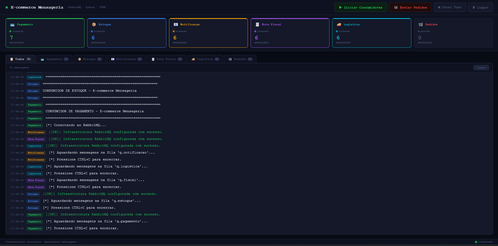

# E-commerce Mensageria com RabbitMQ

**Trabalho Prático – Sistemas Distribuídos | FURB**

---

## 1. Descrição do Cenário

O presente trabalho propõe a implementação de um sistema distribuído baseado em mensageria para simular o processamento de pedidos em um ambiente de comércio eletrônico (e-commerce).

Em sistemas tradicionais, o processamento de pedidos ocorre de forma síncrona, onde cada etapa (pagamento, estoque, emissão de nota fiscal, logística e notificação) é executada sequencialmente. Esse modelo apresenta limitações de escalabilidade, desempenho e tolerância a falhas, pois qualquer atraso ou erro em um dos serviços pode impactar diretamente a experiência do usuário.

Para resolver esse problema, foi adotada uma arquitetura baseada em mensageria utilizando o RabbitMQ, permitindo que o sistema opere de forma assíncrona. Nesse modelo, o serviço de pedidos apenas publica uma mensagem contendo os dados do pedido, enquanto os demais serviços processam essa mensagem de forma independente.

Essa abordagem proporciona:

* Desacoplamento entre serviços
* Maior escalabilidade
* Melhor tolerância a falhas
* Processamento paralelo

---

## 2. Arquitetura da Solução

A arquitetura do sistema é composta por:

* **Produtor (Serviço de Pedidos):**
  Responsável por gerar pedidos e publicá-los no RabbitMQ.

* **Broker (RabbitMQ):**
  Responsável por intermediar a comunicação entre produtor e consumidores.

* **Consumidores:**

  * Pagamento
  * Estoque
  * Notificação
  * Fiscal
  * Logística

Cada consumidor é responsável por uma etapa específica do processamento do pedido.

### Fluxo de Mensagens

1. O produtor gera um pedido.
2. A mensagem é publicada na exchange `pedidos_exchange`.
3. A exchange distribui a mensagem para todas as filas vinculadas.
4. Cada consumidor processa a mensagem de forma independente.
5. Em caso de sucesso, a mensagem é confirmada (ACK).
6. Em caso de falha, ocorre retry ou envio para DLQ.

---

## 3. Configuração do RabbitMQ

A infraestrutura foi configurada com os seguintes componentes:

### Exchange

* Nome: `pedidos_exchange`
* Tipo: `topic`
* Função: distribuir mensagens para múltiplas filas

### Filas

* `q.pagamento`
* `q.estoque`
* `q.notificacao`
* `q.fiscal`
* `q.logistica`

Todas as filas são duráveis, garantindo persistência.

### Dead Letter Queue (DLQ)

* Exchange: `dlx_exchange`
* Fila: `q.dead_letter`
* Função: armazenar mensagens que falharam após múltiplas tentativas

### Retry

* Implementado com `basic_nack` e requeue
* Limite definido por `MAX_RETRIES`

### TTL (Time To Live)

* 1 hora por mensagem
* Evita acúmulo de mensagens antigas

### Confiabilidade

* ACK manual (`auto_ack=False`)
* Mensagens persistentes (`delivery_mode=2`)
* Prefetch (`basic_qos=1`)

---

## 4. Exemplos de Uso

### Caso 1 – Pedido com sucesso

1. Pedido é publicado
2. Pagamento aprovado
3. Estoque reservado
4. Nota fiscal emitida
5. Entrega agendada
6. Notificação enviada

### Caso 2 – Falha no pagamento

1. Pagamento recusado
2. Mensagem reenfileirada (retry)
3. Após atingir limite → DLQ

### Caso 3 – Falha de estoque

1. Produto indisponível
2. Retry ocorre
3. Pode resultar em DLQ

---

## 5. Considerações Técnicas

### Tecnologias utilizadas

* Python 3
* RabbitMQ
* Docker
* Html
* Css
* Javascript

### Padrão de mensagens

* JSON (UTF-8)

### Boas práticas adotadas

* Filas duráveis
* Mensagens persistentes
* ACK manual
* DLQ para falhas
* TTL para controle de mensagens
* Processamento assíncrono
* Separação de responsabilidades (microserviços)

### Interface e Monitoramento

O sistema conta com um dashboard web que permite:

* Iniciar e parar consumidores
* Visualizar logs em tempo real
* Monitorar status dos serviços

---

## 6. Diagrama de Arquitetura

---

## 7. Interface do Sistema

---

## 8. Conclusão

A utilização do RabbitMQ permitiu a construção de uma arquitetura desacoplada, escalável e resiliente. O sistema desenvolvido demonstra como a mensageria pode ser aplicada em cenários reais para melhorar o desempenho e a confiabilidade.

Além disso, o uso de boas práticas como DLQ, TTL e ACK manual contribui para a robustez da solução.

O projeto atende aos requisitos propostos e evidencia a importância da mensageria em sistemas distribuídos modernos.

---
